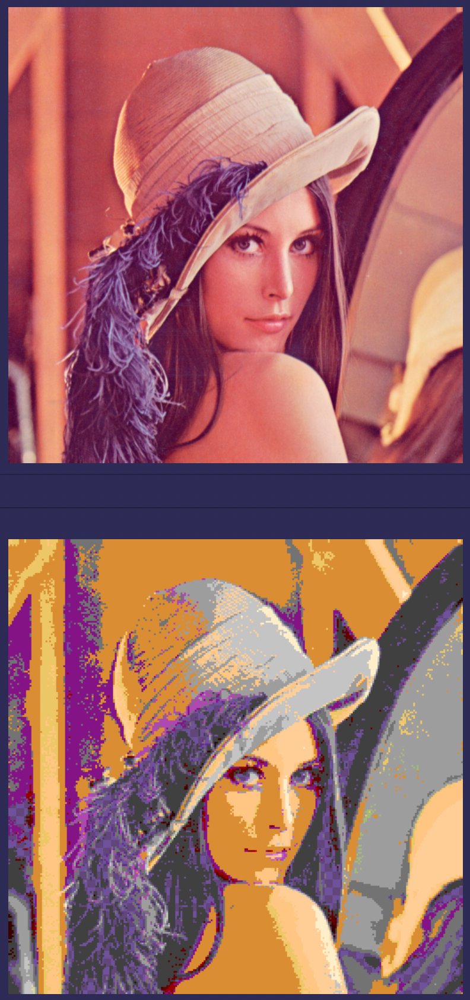

# Mosaic

Generate a photo mosaic

```bash
# Create mosaic of portrait.png from Photos as tiles
# displayed on a 32x32 grid. Output to be written on Mosaic directory
$ mosaic portrait.png Photos 32,32 Mosaic 
...
Source grid: [1021] {126  50  76}       Closest img: [01] { 87  59 110}
Source grid: [1022] {117  43  72}       Closest img: [01] { 87  59 110}
Source grid: [1023] {117  38  66}       Closest img: [01] { 87  59 110}
Output written to : Photos/portrait_out.png
```

